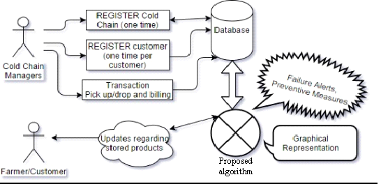

                    *__Nominated for Power-Judging round__*

                                  _under_

                      Ministry of Food Processing Industries

                                    _at_

                     Smart India Hackathon 2017 Grand Finale

## Team: **DrishtiC0n**

| Backend | Design  | Research  |
| ------- | ------- | --------- |
| [Mukul Garg](https://m4mukulgarg.github.io/about-me/) | Samridhi Jain | Ankush Garg |
| [Sajal Garg](https://www.linkedin.com/in/sajal-garg-247609157/)  | Saurav Panwar  | Sarthak Sharma |

## Aim:
To add a window on the Ministry's website to monitor Key Performance Indicators of cold chain projects for helping in better policy-making.

## Summary:
The MoFPI has set up cold chains but there is no provision for real-time monitoring of their performance. This project will help the Ministry to monitor these cold chains by providing analysis of data under an intuitive and user-friendly interface.
The project includes proposing a set of efficient algorithms and using them on data that is collected from the cold chains in real time.  All the KPIs collectively will show the performance of the specific cold chain.
Ministry will have the option to view the performance of either a region-wise selection of cold chains or a specific cold chain on the basis of a selection of KPIs.

## Introduction:
Ministry will be provided with an interface where the performance of cold chains can be monitored and analysed. The KPI proposed will be presented graphically for a better understanding by ministry executives.
Following is a brief outline of the project:
Using this interface, cold chain managers should register on the multilinguistic window by using their license no. submitting details about infrastructure and manpower of their respective cold chains. After registration, the managers will be required to process and manage the real-time transactions on the portal. From this real time data, KPIs would be generated that will help the ministry executive for better understanding and consequent policy making.
Using the KPIs the proposed system will automatically generate alerts for performance issues and recommend solutions to enhance performance. These alerts will be delivered using emails or SMS as per preference.

## Objectives:
* To provide a monitoring interface to the ministry that will help in better policy-making for cold chains.
* To demonstrate graphically the performance of the cold chains.
* To generate alerts about probable failures and recommend preventive measures, hence minimising the failure rate of cold chains.
* To optimize the utilisation of resources i.e., storage, employees, reefer vans etc.
* To justify the need for a cold chain in a region based on suggested attributes.

## Status
This project had been developed during the Smart India Hackathon 2017. It has the following features:
* Graphical interface for the cold chain performance measurement.
* Forms for cold chain registration, farmer registration and other data inputs.
* Periodic KPI generation (since the data is only received periodically).

To the best of our knowledge, the system is novel and will provide considerable benefits to cold chain industry.

## Novelty
* Resource utilisation:  The system will be able to recommend methods for optimal utilisation of resources like manpower, reefer vans and storage.
* Alert Generation: The system will be able to generate alerts about probable failures and recommend potential solutions.
* Receipt/Message Service: The farmers will be provided with receipts as well as SMS updates about the status of their products stored at the cold chain site.
* Product Tracking (or wastage minimization): Adequate & efficient cold chain tracking from farm gate to consumers which can further arrest high losses in the supply chain of perishables.

## Work Plan
### Phase 1: Information Gathering & Requirement Analysis
Information will be gathered in this phase by surveying selective cold chains from different regions for the following:
* For a better understanding of the functioning and activities carried out by the cold chains. 
* To determine the issues faced by the cold chains and needs of the farmers.
* To deduce what data can be gathered at each and every stage of the supply line.
* To analyse how these cold chains utilise different assets and resources.

### Phase 2: Design
This phase is dedicated to the design and finalisation of the database as well as the algorithms used in this project.
The UI design consists of wire-frame design for all the data fields and how they are connected.
Algorithm design consists of the designing algorithms used for generation of KPIs as well as the algorithms for maximum resource utilisation, failure determination and alert generation.

### Phase 3: Coding & Development
#### Front-End
* An interactive UI will be designed to best suit the needs of the ministry, in coordination with the ministry official/mentor assigned.
* A user-friendly UI will be generated for easy data input by cold chain executives.

#### Back-End
* The algorithms will be used to generate KPI and represent them graphically in the frontend.
* Algorithms will be used for suggestions leading to maximum resource utilisation.
* Alerts will be generated in case of probable failure.
* Improved database design would be created. 
Finally, both the frontend and backend will be linked together. 

### Phase 4: Testing & Handing over 
* In this phase, a dummy database will be created to ensure proper functioning of algorithms as well as generation of KPIs.
* The alert generation system will be tested by providing a failing cold chain to the proposed system and maximum resource generation suggestions will be tested by checking the feasibility of suggested solutions in real world scenario.
* Furthermore, the proposed project will be handed over to the ministry cold chains for their analysis of the proposed system and will provide the scope of improvement and bugs present in the system. 
* All the bugs will be resolved in this phase of the project.
* During this phase, all the changes or modifications suggested by the ministry will be taken into account and the final project will be handed to the ministry.

## Technology Stack
Microsoft ASP.NET and C#

## Architecture Block Schematic

## References
### Literature available on the government websites:
* http://www.nccd.gov.in/PDF/Mofpi.pdf
* http://www.nccd.gov.in/PDF/CCSG_Final%20Report_Web.pdf
* http://mofpi.nic.in/sites/default/files/135coldchainproject.pdf
* http://www.nccd.gov.in/PDF/NCCDGuidelines2014-15.pdf

### Research papers referred:
* Joshi, Rohit, D. K. Banwet, and Ravi Shankar. "A Delphi-AHP-TOPSIS based benchmarking framework for performance improvement of a cold chain." Expert Systems with Applications 38.8 (2011): 10170-10182.
* Shabani, Amir, Reza Farzipoor Saen, and Seyed Mohammad Reza Torabipour. "A new benchmarking approach in Cold Chain." Applied Mathematical Modelling 36.1 (2012): 212-224.
* Montanari, Roberto. "Cold chain tracking: a managerial perspective." Trends in Food Science & Technology 19.8 (2008): 425-431.
* Maheshwar, C., and T. S. Chanakwa. "Postharvest losses due to gaps in cold chain in India-a solution." IV International Conference on Managing Quality in Chains-The Integrated View on Fruits and Vegetables Quality 712. 2006.

[Download this document as pdf](https://drive.google.com/open?id=0B1KLs5DBrLdlREtPbXpxVW5EM1E)
